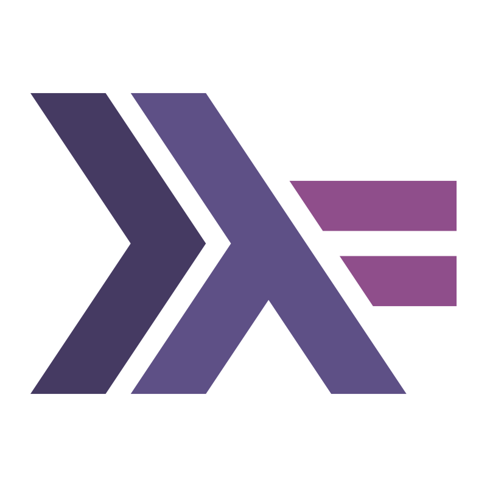

Hi, my name is **Spencer Mutch**. 

I am a 4th year Computer Science student at the University of Calgary. I've always been passionate about technology, and began programming early in high school. Over the past few years I've cultivated a strong enthusiasm for solving complex problems and turning creative ideas into tangible results.

My academic journey has equipped me with a solid foundation in software development, algorithms, and system design, while my personal projects have allowed me to dive into cutting-edge technologies and tools. From web development and app design to machine learning experiments and intuitive user interfaces, I thrive on challenges that push me to learn and grow.

Whether working with a team to brainstorm new ideas or tackling individual projects, I’m driven by the opportunity to make an impact through technology. I’m always excited to connect with others who share a passion for technology. Feel free to explore my projects or reach out to discuss collaboration opportunities and ideas.

Please take a look at some of my [projects!](/projects/)

Skills

  

    
    
Python

  

  

  <!-- Using  to display the JavaScript logo -->
    
    
Java

  

  

    
    
JavaScript

  

  

    
    
C

  

  

    
    
C++

  

  

    
    
C#

  

  

    
    
HTML

  

  

    
    
Swift

  

  

    
    
Kotlin

  

  

    
    
Visual Studio

  

  

    
    
TensorFlow

  

  

    
    
Haskell

  

